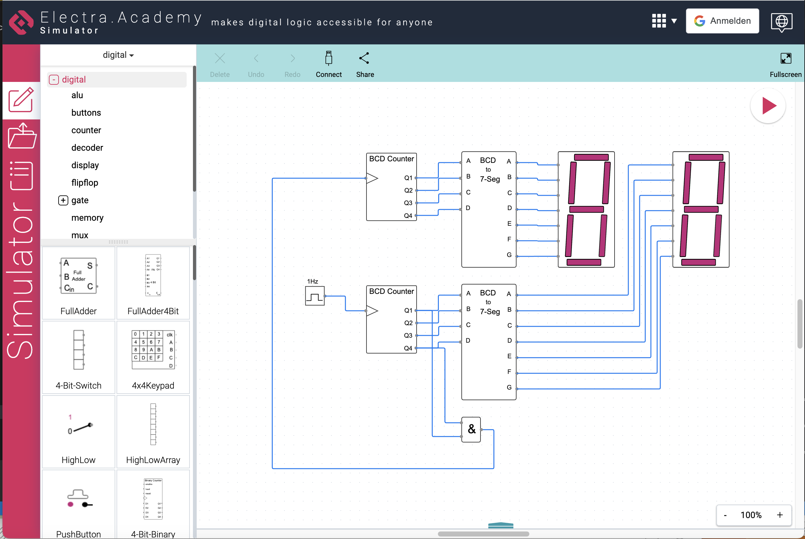

# Electra.Academy
Circuits are better animated. Create, simulate, share, and explore electronic circuits!

## See It in Action
When you make changes to your circuit design, Electra.Academy will show you animated simulations of how the logic changes are affecting your circuit. You'll be able to see exactly how your circuit is operating!

## Test It Out
Even if you've just come up with a brand new circuit design, Electra.Academy has got you covered. With its special circuit simulation engine, you'll be able to see how your circuit is working and make adjustments as needed.

## Play Around
You can even adjust the circuit parameters while the simulation is running, and watch in real-time how your circuit responds. It's a fun and interactive way to learn about circuit design!

Hosted on [https://electra.academy](https://electra.academy)

