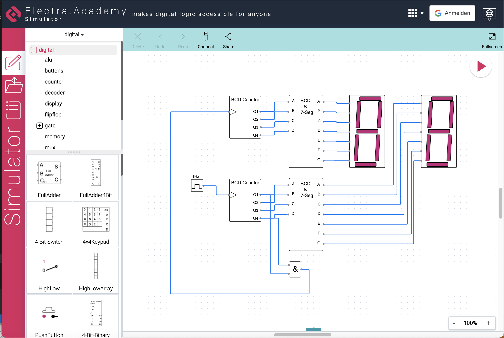

# Electra.Academy
Circuits are better animated. Create, simulate, share, and explore electronic circuits!

## See It in Action
When you make changes to your circuit design, Electra.Academy will show you animated simulations of how the logic changes are affecting your circuit. You'll be able to see exactly how your circuit is operating!

## Test It Out
Even if you've just come up with a brand new circuit design, Electra.Academy has got you covered. With its special circuit simulation engine, you'll be able to see how your circuit is working and make adjustments as needed.

## Play Around
You can even adjust the circuit parameters while the simulation is running, and watch in real-time how your circuit responds. It's a fun and interactive way to learn about circuit design!

Hosted on [https://electra.academy](https://electra.academy)

## License

Electra.Academy is licensed under the **GNU Affero General Public License v3.0
or later** (`AGPL-3.0-or-later`). The full text is in [`LICENSE`](./LICENSE).

**Schools, educational institutions, individuals and non-profit groups: free to
use, and explicitly welcome.** The AGPL makes no distinction between commercial
and non-commercial use, so a school with tuition fees or a public body with a
fee-funded budget does not have to work out whether it qualifies for an
exemption. It does.

In return, the AGPL requires that anyone distributing the software - or
operating a modified version as a network service (AGPL section 13) - makes the
complete corresponding source available under the same license. In short: you
may earn money with Electra.Academy, but you may not close it.

- Plain-language summary, German and English: [`LICENSING.md`](./LICENSING.md)
- Proprietary or closed-service use: [`COMMERCIAL-LICENSE.md`](./COMMERCIAL-LICENSE.md)
- Bundled third-party components and their licenses: [`THIRD-PARTY-NOTICES.md`](./THIRD-PARTY-NOTICES.md)

### Support for schools

Hosting, operation, maintenance, support and training are services and are not
restricted by the license - no commercial license needed to buy them. Enquiries:
<a.herz@freegroup.de>

## Contributing

Bug reports, fixes, translations and teaching material are welcome. Please read
[`CONTRIBUTING.md`](./CONTRIBUTING.md) first - it explains the license terms for
contributions and why there is an additional copyright grant.

